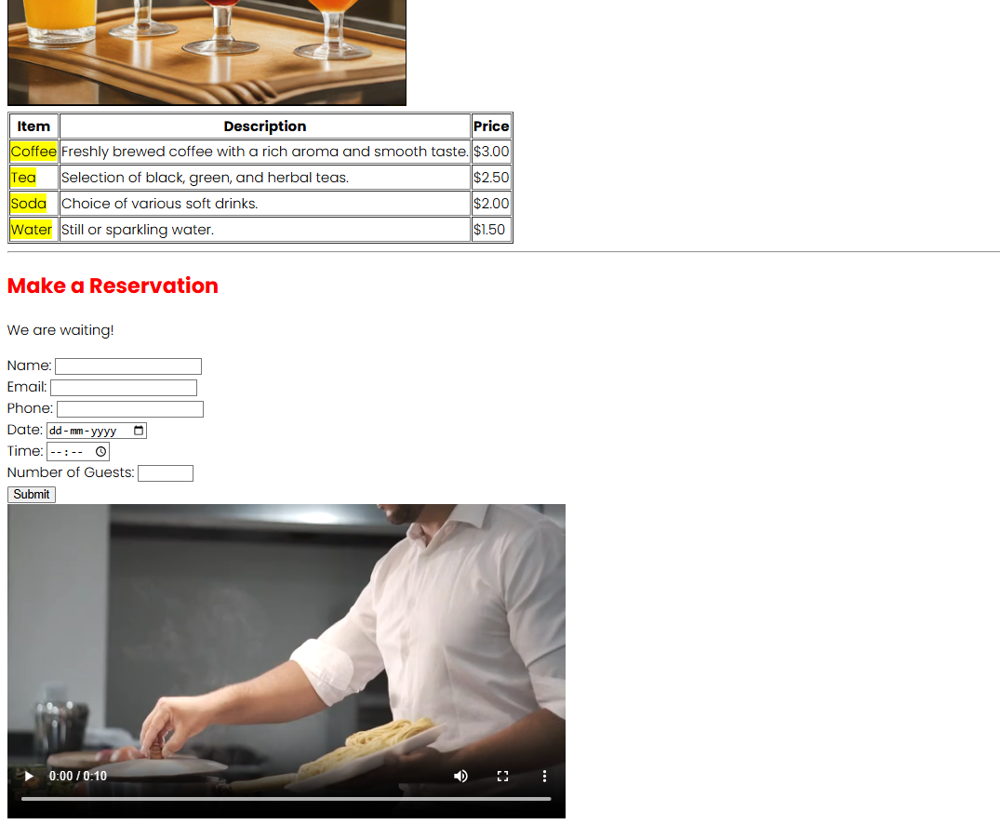
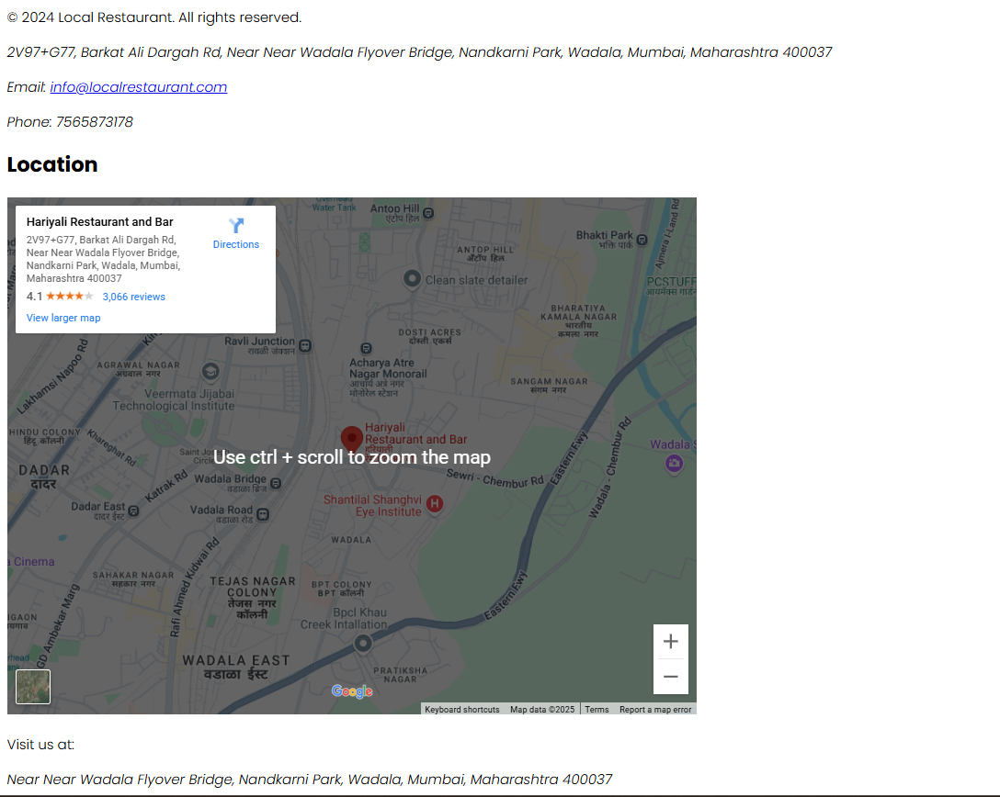

<h1>Local Restaurant Menu 📋🍽️</h1>

## Overview
> This is one of the first project that I made using only HTML, no CSS and JavaScript used, take a look, how a website look with html skeleton.

---

## Features
- images
- videos
- hyperlinks
- google maps
- forms
- ratings
- contact
> Uses to make

---

**Screenshots**

